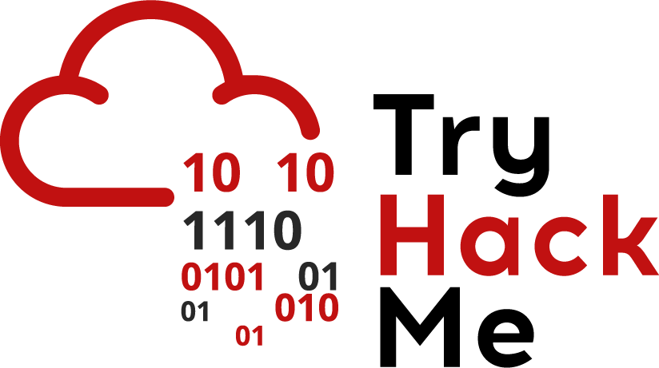
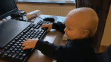

# Repository of   [T̲̅][r̲̅][y̲̅][H̲̅][a̲̅][c̲̅][k̲̅][M̲̅][e̲̅]   🚩🚩🚩 匚ㄒ千 🚩🚩🚩

## 🅸🅽🆃🆁🅾🅳🆄🅲🆃🅸🅾🅽
This is the repository where I document the CTF challenges in the famous and addictive platform made for cybersecurity enthusiast which is `TryHackMe`. 
  
I categorized the CTF challenges base on difficulty level (`easy`, `medium`, `hard`)

## 🆆🅷🅰🆃 🅸🆂 🅲🆃🅵?
CTF commonly stands for `Capture the Flag`, a popular cybersecurity competition where participants solve puzzles and hack simulated systems to find hidden strings of text known as `flags`.

## 🆆🅷🆈 🅲🆃🅵 🅸🆂 🅸🅼🅿🅾🆁🆃🅰🅽🆃?
Capture the Flag (CTF) competitions are essential in cybersecurity because they provide hands-on, practical experience in spotting and exploiting system vulnerabilities. They act as a safe `digital playground` to test hacking techniques and problem-solving skills without real-world legal or financial consequences.

## 🏆🏅 🅲🅾🅼🅿🅻🅴🆃🅴🅳 C͓̽T͓̽F͓̽ ͓̽R͓̽o͓̽o͓̽m͓̽s͓̽ 🆆🆁🅸🆃🅴-🆄🅿 🏅🏆

| Room Name | Description | Difficulty Level | Tools Used |
| -------- | -------- | -------- | -------- |
| [LazyAdmin](https://github.com/arrdomingov3/tryhackme/blob/main/ctf-easy/lazy-admin/README.md) `In-progress, room is locked due to stability of VM.` | This room is about web directory discovery and CMS exploitation. This is an easy Linux machine to practice. | Easy | nmap, gobuster, wordlist |
<!-- | [Simple CTF](https://github.com/arrdomingov3/tryhackme/blob/main/ctf-easy/simple-ctf/README.md) | Beginner level ctf  | Easy | Linux VM, nmap | -->

## References
- [Text Effects](https://en.textdrom.com/)
- [Github .md emoji markup](https://gist.github.com/rxaviers/7360908)
