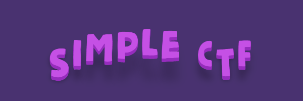

| <h1>💡ROOM INFORMATION </h1> |  |
| ---               | ---                   |
| Room Title        | [Simple CTF](https://tryhackme.com/room/easyctf)            |
| Room Description  | Beginner level ctf    |
| Room Type         | Free Room             |
| Room Difficulty   | Easy                  |
| Tools Used        | Linux VM, nmap             |
| Created by        | [MrSeth6797](https://tryhackme.com/p/MrSeth6797)  |

# 🏁 STEP-BY-STEP PROCEDURE
As the room decription stated, this is a beginner level CTF which is good for beginners who are trying to crack the whole process of pentesting. Below are the process I did to accomplish the task.

- Join the room.
- Deploy the VM.
- For any exploitation, the first step is to find an entry point
- > ❓ How many services are running under port 1000?  👉 2
- > ❓ What is running on the higher port? 👉 ssh
- > ❓What's the CVE you're using against the application? 👉 CVE-2019-9053
- > ❓ To what kind of vulnerability is the application vulnerable? 👉 sqli
- > ❓ What's the password? 👉 secret
- > ❓ Where can you login with the details obtained? 👉 ssh
- > ❓ What's the user flag? 👉 G00d j0b, keep up!
- > ❓ Is there any other user in the home directory? What's its name? 👉 sunbath
- > ❓ What can you leverage to spawn a privileged shell? 👉 vim
- > ❓ What's the root flag? 👉 W3ll d0n3. You made it!

